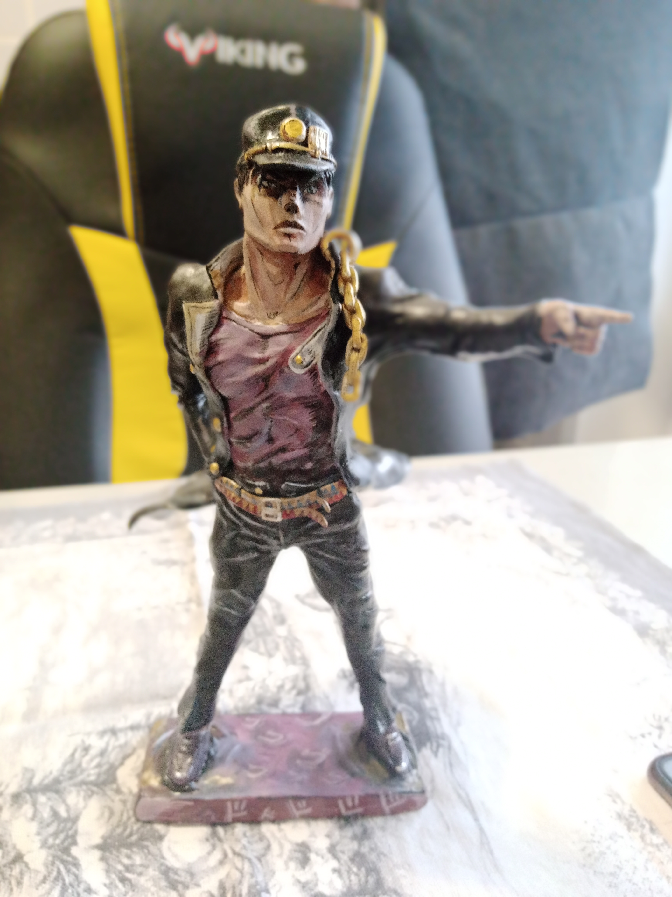

# Инструкция для работы с markdown

## Выделение текста 
Чтоб выделить текс полужирным, нужно обрамить звёздочками или двойным нижним подчёркиванием, например: **вот так** или __вот так__

Чтобы выделить текст курсивом, нужно обрамить звёздочками, или обрамить двойным нижним подчёркиванием, например: *вот так* или _вот так_

Альтернытивные способы выделения текста жирныим или курсивом нужны для того чтобы мы могли совмещать оба эти способа. Например: *Текст может быть выделен курсивом и при этом быть __полужирным__*

## Списки

## Работа с изображениями
Чтобы вставить изображение в текст, достаточно написать следующее:

## Ссылки

## Таблицы 

## Цитаты

## Заключения